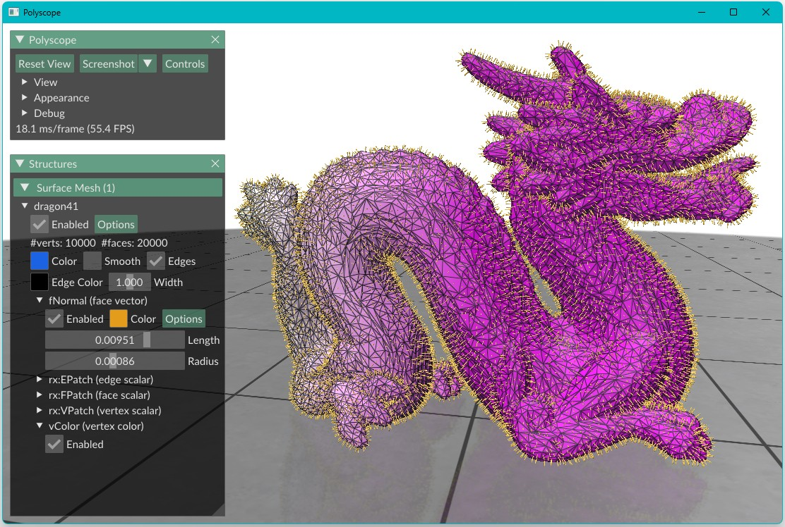

# Getting Started

Before diving into code, it is important to understand how to *think* when using RXMesh.

The mental model is simple: you start with a triangle mesh—typically provided as a standard `.obj` file—and RXMesh takes care of converting it into a GPU-friendly data structure. Once the mesh is loaded, everything you do revolves around performing operations *per mesh element*—whether that is a vertex, edge, or face.

These per-element operations are typically expressed using **parallel loops** or **query kernels**. RXMesh handles the connectivity, locality, and memory layout behind the scenes. You get to write clean code that feels high-level but is executed with low-level efficiency.

RXMesh provides an easy way to allocate and manipulate **mesh attribute**. Mesh attributes are values associated with mesh elements: a vertex color, a face normal, a scalar tag per edge, etc. Attributes are **strongly typed**—a vertex attribute knows it is tied to vertices, and can not be accidentally used with faces or edges. This gives your code more clarity and safety.

Attributes also live in multiple locations—on the **host** or on the **device**—and you control when and how they move. This separation allows RXMesh to give you performance without compromising on flexibility.

In this first example, we will walk through a simple but complete application:  
- Load a triangle mesh from an `.obj` file  
- Access vertex positions  
- Define and compute vertex colors and face normals  
- Visualize the results using Polyscope

This example touches on key RXMesh ideas: attributes, mesh traversal, kernel execution, and device/host memory movement. Later sections will go deeper into how these pieces work and how they scale up to large and dynamic meshes.


```c++
using namespace rxmesh;

//Initialize RXMesh. 0 is the GPU device ID. 
rx_init(0);

RXMeshStatic rx("mesh.obj");

// Vertex Coordinates 
auto vertex_pos = *rx.get_input_vertex_coordinates();

// Vertex Color
auto vertex_color = *rx.add_vertex_attribute<float>("vColor", 3);
rx.for_each_vertex(
    DEVICE, [vertex_color, vertex_pos] __device__(const VertexHandle vh) {
        vertex_color(vh, 0) = 0.9;
        vertex_color(vh, 1) = vertex_pos(vh, 1);
        vertex_color(vh, 2) = 0.9;
    });

// Face Normal
auto face_normal = *rx.add_face_attribute<float>("fNormals", 3);
rx.run_query_kernel<Op::FV, 256>(
    [=] __device__(FaceHandle face_id, VertexIterator & fv) mutable {
        // get the face's three vertices coordinates
        const vec3<float> c0 = vertex_pos.to_glm<3>(fv[0]);
        const vec3<float> c1 = vertex_pos.to_glm<3>(fv[1]);
        const vec3<float> c2 = vertex_pos.to_glm<3>(fv[2]);

        // compute the face normal
        glm::fvec3 n = cross(c1 - c0, c2 - c0);

        n = glm::normalize(n);

        // store the normals
        face_normal.from_glm(face_id, n);
    });

//Move attributes to the host 
vertex_color.move(DEVICE, HOST);
face_normal.move(DEVICE, HOST);

//Visualize using Polyscope
auto ps_mesh = rx.get_polyscope_mesh();
ps_mesh->addVertexColorQuantity("vColor", vertex_color);
ps_mesh->addFaceVectorQuantity("fNormal", face_normal);

polyscope::show();

```

If everything is set up correctly, you should see something like this—your mesh visualized with per-vertex color and face normals:

<p align="left">
  
</p>