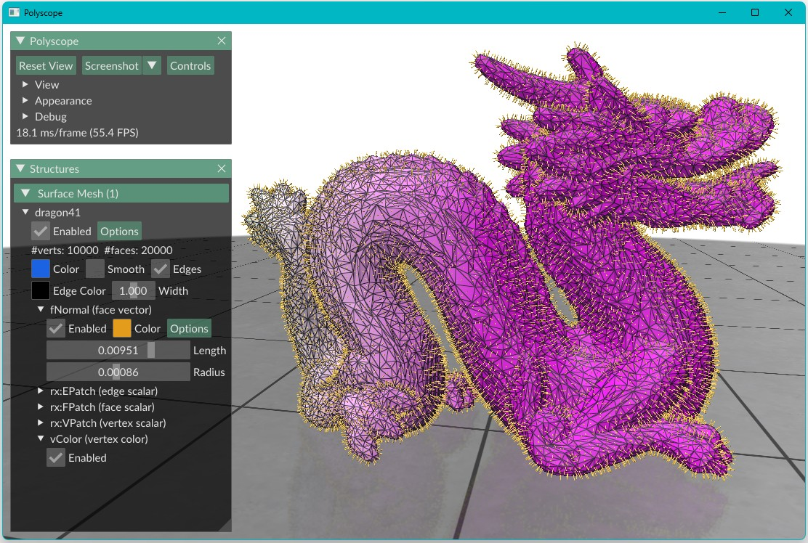

# **Your First Application**

Before diving into code, it is important to understand how to *think* when using RXMesh.

The mental model is you start with a triangle mesh (typically provided as a standard `.obj` file) and RXMesh takes care of building a the GPU data structure. Once the mesh is loaded, everything you do revolves around performing local operations *per mesh element* whether that is a vertex, edge, or face.

These per-element operations are typically expressed using **parallel loops** or **query kernels**. RXMesh handles the connectivity, locality, and memory layout behind the scenes. You get to write clean code that feels high-level but is executed with low-level efficiency.

RXMesh provides an easy way to allocate and manipulate **mesh attributes**. Mesh attributes are values associated with mesh elements, e.g., a vertex color, a face normal, or a scalar tag per edge. Attributes are **strongly typed**, i.e., a vertex attribute knows it is tied to vertices and cannot be accidentally used with faces or edges. This gives your code more clarity and safety.

By default, attributes live on both the **host** and the **device** and you control when and how they move. This separation allows RXMesh to give you performance without compromising on flexibility.

In this first example, we will walk through a simple but complete application:  

- Load a triangle mesh from an `.obj` file  
- Access vertex positions  
- Define and compute vertex colors and face normals  
- Move computed attributes from device to the host 
- Visualize the results using Polyscope


```c++
using namespace rxmesh;

//Initialize RXMesh. 0 is the GPU device ID. 
rx_init(0);

RXMeshStatic rx("mesh.obj");

// Vertex Coordinates 
auto vertex_pos = *rx.get_input_vertex_coordinates();

// Vertex Color
auto vertex_color = *rx.add_vertex_attribute<float>("vColor", 3);
rx.for_each_vertex(
    DEVICE, [vertex_color, vertex_pos] __device__(const VertexHandle vh) {
        vertex_color(vh, 0) = 0.9;
        vertex_color(vh, 1) = vertex_pos(vh, 1);
        vertex_color(vh, 2) = 0.9;
    });

// Face Normal
auto face_normal = *rx.add_face_attribute<float>("fNormals", 3);
rx.for_each<Op::FV, 256>(
    [=] __device__(FaceHandle face_id, VertexIterator & fv) mutable {
        // get the face's three vertices coordinates
        const vec3<float> c0 = vertex_pos.to_glm<3>(fv[0]);
        const vec3<float> c1 = vertex_pos.to_glm<3>(fv[1]);
        const vec3<float> c2 = vertex_pos.to_glm<3>(fv[2]);

        // compute the face normal
        glm::fvec3 n = cross(c1 - c0, c2 - c0);

        n = glm::normalize(n);

        // store the normals
        face_normal.from_glm(face_id, n);
    });

//Move attributes from the device to the host 
vertex_color.move(DEVICE, HOST);
face_normal.move(DEVICE, HOST);

//Visualize using Polyscope
auto ps_mesh = rx.get_polyscope_mesh();
ps_mesh->addVertexColorQuantity("vColor", vertex_color);
ps_mesh->addFaceVectorQuantity("fNormal", face_normal);

polyscope::show();

```

If everything is set up correctly, you should see something like this, i.e., a mesh visualized with per-vertex color and face normals:

<figure markdown="span">
  { width="600"}
</figure>


This example touches on several core RXMesh concepts, e.g., mesh [attributes](../rxmesh/working_with_attributes.md), element-wise traversal with [`for_each`](../rxmesh/for_each.md), [connectivity-based`for_each<Op, blockThreads>`](../rxmesh/for_each.md#connectivity-for_each-query-op) computation, and moving data between the host and device. In the following sections, we will explore these ideas in more depth and cover [additional operations on static meshes](../rxmesh/static.md), [attribute manipulation](../rxmesh/working_with_attributes.md), working with [sparse](../rxmesh/sparse_matrices.md) and [dense](../rxmesh/dense_matrices.md) matrices, [linear system solvers](../rxmesh/solvers.md), [handling dynamic connectivity](../rxmesh/dynamic.md), and performing [automatic differentiation](../rxmesh/ad.md) on the GPU.
