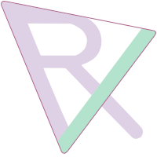

---
hide:
  - toc
---

#

<p align="left">
  
</p>

RXMesh is a GPU-accelerated framework for mesh processing. It lets you write geometry processing applications (e.g., smoothing, remeshing, parameterization, simulation, and more) that run entirely on the GPU, without manually managing connectivity data structures, memory layouts, or kernel launch configurations.

```c++
// Load a triangle mesh and build the GPU data structure
RXMeshStatic rx("mesh.obj");

auto coords = *rx.get_input_vertex_coordinates();

// Allocate a 3-component float attribute on every face
auto normals = *rx.add_face_attribute<float>("fNormals", 3);

// For each face, query its vertices (Op::FV) using 256 threads per block
rx.for_each<Op::FV, 256>(
    // Device lambda function runs on the GPU; [=] captures attributes by value
    [=] __device__(FaceHandle fh, VertexIterator& fv) mutable {

        // fv[0], fv[1], fv[2] are the face's three vertex handles
        vec3<float> n = cross(coords.to_glm<3>(fv[1]) - coords.to_glm<3>(fv[0]),
                               coords.to_glm<3>(fv[2]) - coords.to_glm<3>(fv[0]));

        // Write the result back to the face attribute
        normals.from_glm(fh, normalize(n));
    });
```

Under the hood, RXMesh partitions the mesh into compact **patches** that fit in GPU shared memory, enabling fast neighborhood queries without global memory access. The API hides this complexity behind a small set of concepts (e.g., **handles**, **attributes**, and **query operations**) so you can focus on the algorithm, not the data structure.

**What RXMesh provides:**

- **[Static mesh processing](rxmesh/static/static.md):** Parallel per-element operations and neighborhood queries over meshes with fixed connectivity.
- **[Dynamic mesh processing](rxmesh/dyn/dynamic.md):** Topology-changing operations (edge flips, splits, collapses) with automatic patch management.
- **[Sparse and dense matrices](rxmesh/matrix/dense_matrices.md):** A linear algebra layer tightly coupled with the mesh, backed by cuSolver, cuSparse, and cuBLAS, with direct and iterative [solvers](rxmesh/matrix/solvers.md).
- **[Automatic differentiation](rxmesh/diff/ad.md):** GPU forward-mode AD for computing gradients and Hessians of mesh-based energies, with built-in optimizers.

RXMesh handles meshes of any quality, including non-manifold inputs. To get started, head to the [Getting Started](getting-started/building.md) section, or bootstrap a new project with the [RXMesh template project](https://github.com/owensgroup/RXMeshTemplate).

--- 

## **Replicability**

This repo was awarded the [replicability stamp](https://www.replicabilitystamp.org/#https-github-com-owensgroup-rxmesh) by the Graphics Replicability Stamp Initiative.