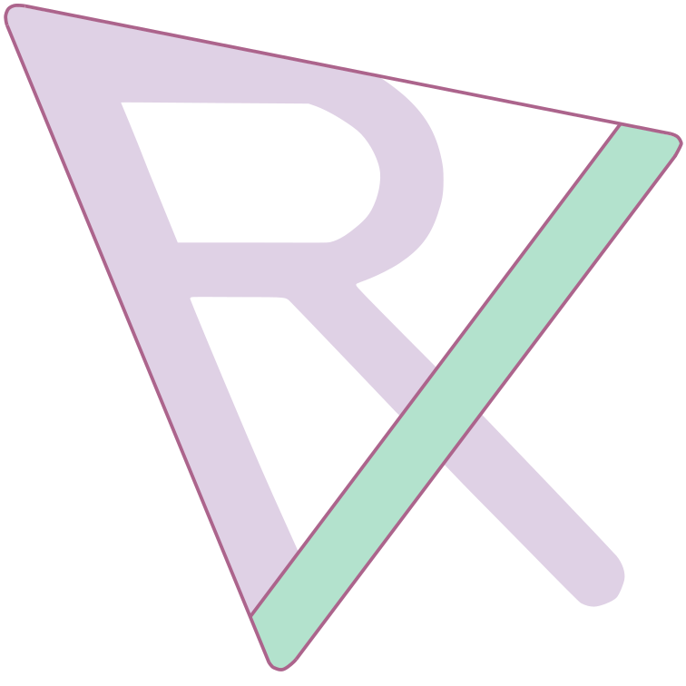

#

  

RXMesh is a library for processing triangle mesh entirely on the GPU. RXMesh goal is to provide a high-performance, generic, and compact data structure that can handle meshes regardless of their quality (e.g., non-manifold). RXMesh support both **static** and **dynamic** (where mesh connectivity changes) mesh processing operations. Our programming model/API helps to hide the complexity of the data structure and provides an intuitive access model for different use cases.

RXMesh also features a **sparse and dense matrix** infrastructure that is tightly coupled with the mesh data structure. We expose various `cuSolver`, `cuSparse`, and `cuBlas` operations through the sparse and dense matrices, tailored for geometry processing applications.

RXMesh also includes support for **Automatic Differentiation** (AD) directly on the GPU. Built on top of its compact mesh and matrix infrastructure, RXMesh enables efficient computation of gradients and Hessians for geometry processing tasks such as optimization, simulation, and inverse design. This AD system is designed to be modular and fast, allowing users to differentiate through mesh-based computations with minimal overhead.

--- 

## **Documentation Roadmap**

This documentation is structured to guide you from setup to advanced use of RXMesh:

- **About**– How to [build](about/building) and [cite](about/bibtex) RXMesh.
- **Getting Started** – Your [first](basics/basic) RXMesh application: compute face normals and visualize them.
- **RXMesh**:
    - [**RXMeshStatic**](rxmesh/static) – Working with static meshes.
    - [**Matrices**](rxmesh/matrices) – Using the sparse and dense matrix infrastructure.
    - [**Solvers**](rxmesh/solvers) – Linear system solvers integrated with RXMesh’s mesh and matrix infrastructure.
    - [**RXMeshDynamic**](rxmesh/dynamic) – Handling dynamic mesh updates on the GPU.
    - [**Autodiff**](rxmesh/ad) – Differentiating mesh-based computations on the GPU.
    - [**Applications**](rxmesh/apps) – Examples that combine these features in real tasks.

Feel free to jump to the section most relevant to you—or follow them in order for a full tour.

You can also start a new project using the [RXMesh template project](https://github.com/owensgroup/RXMeshTemplate) which sets up all dependencies and build scripts using pre-configured CMake setup for GPU/CUDA development, cross-platform support (Windows/Linux) and GitHub Actions CI/CD pipeline.

--- 

## **Replicability**

This repo was awarded the [replicability stamp](https://www.replicabilitystamp.org/#https-github-com-owensgroup-rxmesh) by the Graphics Replicability Stamp Initiative (GRSI).

--- 

## **License**

RXMesh is released under the [BSD-2-Clause License](https://github.com/owensgroup/RXMesh/blob/main/LICENSE). Please note that RXMesh depends on several third-party libraries, each with its own license. See the [dependencies list](about/building/#dependencies) and consult the respective projects for their licensing terms.
