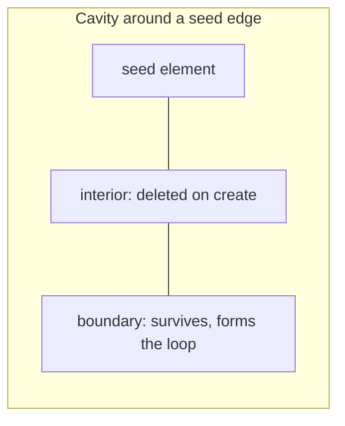
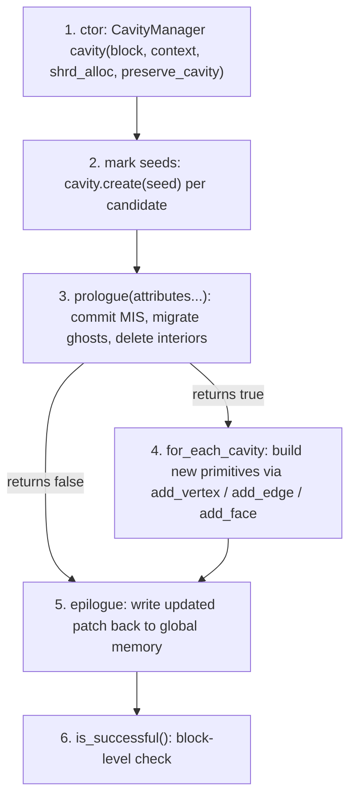

# **Cavity Concepts**

A **cavity** is the unit of topological change in RXMesh. Instead of exposing "edge split", "edge collapse", "edge flip", and "face subdivision" as separate primitives, RXMesh offers one general mechanism: a block **carves a cavity** from its patch, then **fills it back in** with new elements. Every edit, from a trivial edge flip to an arbitrary remesh kernel you write yourself, is expressed in this one shape.

## **Anatomy of a Cavity**

Given a **seed** mesh element, the cavity around it consists of:

- The **interior**: the seed plus every element that has to be deleted so that the region is topologically editable. The interior depends on the [`CavityOp`](cavity_op.md) value: for example, `CavityOp::E` deletes the seed edge and the two triangles incident to it; `CavityOp::EV` additionally deletes the two endpoint vertices; `CavityOp::FV` deletes a face and its three vertices; and so on.
- The **boundary**: the elements that **survive** the cavity. The boundary is a closed loop of edges (and their incident vertices) that your fill-in code reconnects with new elements.

`CavityManager` exposes the boundary via `get_cavity_vertex(c, i)` and `get_cavity_edge(c, i)`, where `i` runs over the `get_cavity_size(c)` edges on the boundary in a consistent order.

## **Three Guarantees You Can Rely On**

When you write a dynamic kernel, you can program against these semantics without thinking about how the library enforces them.

### 1. Non-conflicting subset

Many threads in a block may each call `cavity.create(seed)` on a different seed element. Two cavities **conflict** if their interiors overlap or, when `allow_touching_cavities` is `false`, if their boundaries share an edge. The library picks a **maximal independent set** of non-conflicting cavities, deactivates the rest, and only then proceeds.

The upshot:

- You do not need a mutex or an atomic flag to coordinate seeds with your teammates in the block.
- If your thread's seed was dropped, `cavity.is_successful(seed)` returns `false`; your fill-in code is simply not invoked for that cavity.
- A cavity that was dropped in one pass can be re-seeded in a subsequent pass; the library's [patch scheduler](rxmesh_dynamic.md#patch-scheduler) makes sure the patch is visited again.

### 2. Patch-local topology

Cavities are always local to one patch. If a cavity's interior reaches into a neighbor patch, the library **migrates** the affected ghost elements into the current patch (copying their attribute values too) before calling your fill-in. The fill-in code itself only ever touches elements that belong to the current patch.

Migration has two observable consequences:

- The set of elements `get_cavity_vertex` / `get_cavity_edge` return is a superset of what was originally in the patch.
- Elements whose ownership changes have their attributes re-homed automatically, but only for the attributes you **passed to `prologue`**. Attributes you forgot to forward will have stale values in the new patch.

### 3. All-or-nothing commit

A cavity is either fully committed or fully rolled back. Specifically, `prologue` may fail (e.g., because the block could not lock a neighbor patch it needed to migrate from), in which case **every** cavity seeded by that block is dropped and the patch is redelivered later by the [scheduler](rxmesh_dynamic.md#patch-scheduler). `epilogue` similarly either writes every edit to global memory or discards them all. You never observe a partially-applied cavity.

## **The Cavity Lifecycle**

The device-side workflow is exactly the same for every topological edit, and every operation in the [`CavityOp`](cavity_op.md) enum plugs into it unchanged.

A few practical notes on this lifecycle:

- **Seed selection** typically runs through [`Query::dispatch`](../query.md) so that each seed has access to its local neighborhood for predicate evaluation (e.g., "is this edge longer than threshold X?"). See the worked example in [`CavityManager`](cavity_manager.md#worked-example-edge-split).
- **`preserve_cavity = true`** tells the library to keep the interior elements' topology and attribute data readable during fill-in. Set it when your fill-in needs to, for instance, look up the vertex positions of a deleted edge to compute a midpoint.
- **`prologue` returns `bool`**: always branch on it before touching fill-in state.
- **`epilogue` is mandatory** on every path, even when nothing was committed. It releases locks and restores shared memory.

## **Where to Go Next**

- [`CavityOp`](cavity_op.md) — pick which kind of element to delete.
- [`CavityManager`](cavity_manager.md) — the device class that runs the lifecycle, with a worked edge-split example.
- [`DEdgeHandle`](dedge_handle.md) — the directed-edge handle returned by the fill-in APIs.
- [Host-Side Driver Loop](dynamic_loop.md) — the outer loop that schedules per-patch kernels until the work predicate converges.
